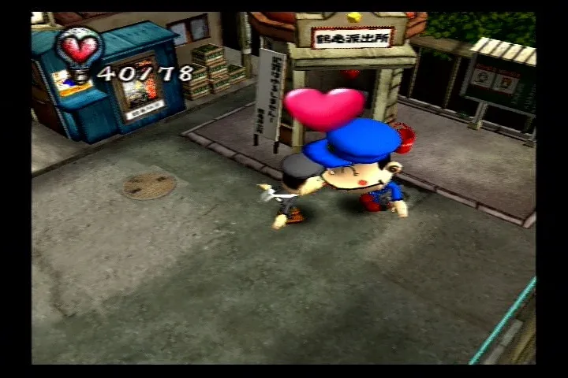

# Chulip (USA) matching decompilation



An in-progress, byte-matching decompilation of the USA PlayStation 2 release
of *Chulip* (`SLUS_207.42`). The goal is a complete, readable source
reconstruction of the game executable. This is not a port, recompilation
shortcut, or assembly transcription.

## About the game

*Chulip* is a PlayStation 2 adventure game developed by Punchline. You explore
Long Life Town, follow its residents' schedules, solve puzzles, and improve
your reputation by finding the right time to kiss each character. Natsume
released this USA version in 2007.

The current source-plus-assembly build reproduces the complete 970,772-byte
loaded image with SHA-256
`77768f0c5d84a92a6d185499b8bb4bb2205779a81fbdb859b15cc1d9ce28f876`.
Assembly generated from the retail executable is temporary scaffolding and is
never counted as decompilation progress.

<!-- decomp-progress-start -->
## Decompilation progress

 

`████████░░░░░░░░░░░░░░░░░░░░░░░░░░░░░░░░` **20.9756%** of provisional text bytes matched

| Metric | Matched | Total | Progress |
| --- | ---: | ---: | ---: |
| Text bytes | 139,216 | 663,704 | 20.9756% |
| Functions | 1,197 | 2,189 | 54.6825% |

Text bytes is the measure to read; small functions are matched first, so the function count runs ahead of it. Only readable C that byte-matches in isolation and in the complete-image rebuild is counted — generated assembly contributes nothing. See [scope and denominator](docs/scope.md).

<!-- decomp-progress-end -->

## Project state

- The USA disc revision, main executable, `PT_LOAD`, and ELF sections are
  fingerprinted in `config/`.
- A zero-C baseline and the current source-plus-assembly project both reproduce
  the complete loaded image exactly.
- The executable was built by two compilers. Game code below roughly
  `0x00185400` is SN Systems GNU C 2.95.3-EE build 1.36 with its bundled
  assembler at `-O2 -G8`; the runtime and library region above it is Sony EE
  GNU C 2.9-ee-991111-01. Both are pinned in `config/toolchains.json`.
- Toolchain claims stay local to the address neighborhood that proves them.
- `DAT/SYSTEM.BIN`, `DAT/SYSTEX.BIN`, SDK code, data, and linker layout remain
  part of the completion scope.

See [scope and denominator](docs/scope.md) for what completion can mean and
which parts of the executable no C compiler can produce.

See [project status](docs/STATUS.md), [architecture notes](docs/architecture.md),
the curated [knowledge book](docs/knowledge-book.md), and the append-only
[matching knowledge ledger](docs/matching-knowledge.jsonl).

## Quick start

You must supply your own verified disc dump. The expected raw BIN hash and
track layout are recorded in `config/disc.json`; no game data is distributed
by this repository.

```sh
python3 tools/bootstrap.py

# Put "Chulip (USA).bin" and its CUE in disc/ first.
python3 tools/mode2_to_iso.py 'disc/Chulip (USA).bin' disc/chulip.iso
python3 tools/iso9660_extract.py disc/chulip.iso --extract original --json

.venv/bin/python configure.py --split
python3 tools/build.py
python3 tools/progress.py
```

Expected successful build output includes `FULL IMAGE MATCH: 970772 bytes`.
The independent zero-C coverage check is:

```sh
.venv/bin/python configure.py --baseline-split
python3 tools/build_baseline.py
```

## Matching workflow

```sh
# Rank unclaimed functions and create a leased work packet.
python3 tools/campaign.py plan --limit 20
python3 tools/campaign.py packet --next --owner NAME

# Check new or changed packet candidates across the compiler matrix.
python3 tools/campaign.py harvest work/campaign/packets/FUNCTION/candidates

# Validate an exact candidate, then apply it through every protected gate.
python3 tools/campaign.py promote FUNCTION
python3 tools/campaign.py promote FUNCTION --write
```

Candidate manifests and lane artifacts stay under ignored `work/`; accepted C,
proof metadata, and reusable conclusions move into `src/`, `config/`, and
`docs/`. Integration independently replays every claimed profile and rejects
ABI-dangerous compiler diagnostics before it records a match.
See [docs/campaign-workflow.md](docs/campaign-workflow.md) for packet metadata,
lease behavior, resumable harvesting, and the promotion boundary.

## Contributing

Issues and pull requests are open.

## Repository layout

| Path | Purpose |
| --- | --- |
| `src/` | Readable reconstructed source |
| `include/` | Shared types, macros, and declarations |
| `config/` | Disc/ELF fingerprints, function catalog, toolchains, and match ledgers |
| `docs/` | Architecture, status, policy, knowledge book, campaign log, and durable findings |
| `tools/` | Extraction, splitting, compilation, matching, build, and audit tools |
| `.github/` | Public-data CI checks |

Generated assembly, extracted files, historical compiler binaries, and build
products are deliberately excluded from Git.

## Matching standard

A function counts only when readable source:

1. reproduces every byte of the isolated retail function;
2. uses a compiler/flag profile supported by its translation-unit neighborhood;
3. survives a clean, complete-image byte-identical rebuild; and
4. is recorded in the match ledger with its evidence.

Full-function assembly, `.word` transcription, embedded target bytes, stubs,
and semantic-only rewrites do not count. The complete policy is in
[docs/DECOMP_POLICY.md](docs/DECOMP_POLICY.md).

## Legal

This project is not affiliated with Punchline, Victor Interactive Software,
Natsume, or Sony. Apart from the README screenshot, do not commit or
distribute disc images, archives, extracted executables, game assets, generated
retail disassembly, or proprietary SDK material. Historical toolchains are
downloaded locally from their respective third-party archives and are not
redistributed here.
